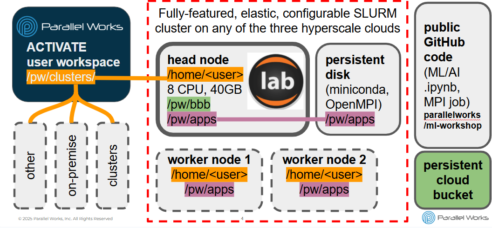
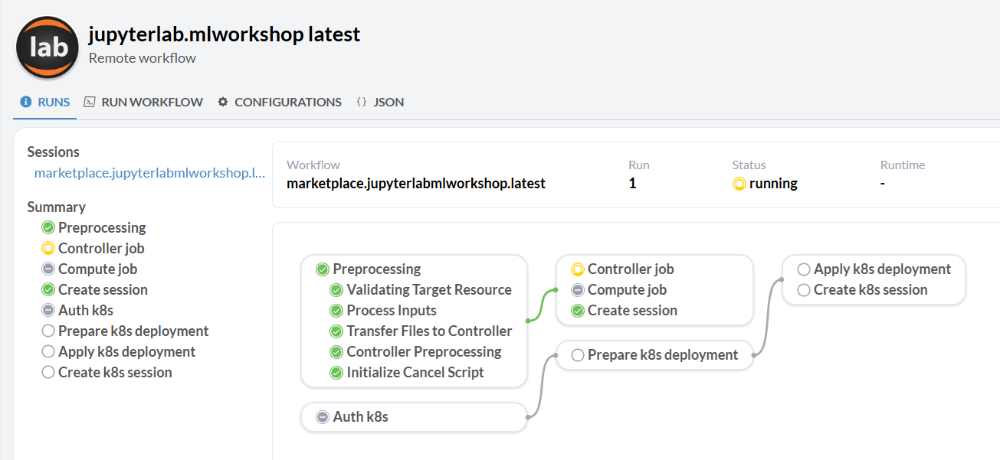
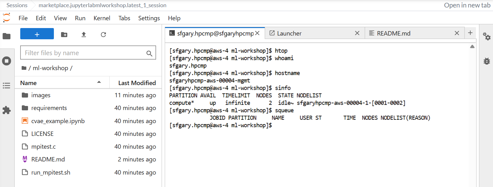

# ml-workshop
Machine learning workshop as an introduction to the Parallel Works ACTIVATE user experience. ACTIVATE is a single control plane for cloud and on-premise high performance resources.

### Please find the link to the [Day 1 overview presentation here.](https://docsend.com/v/8yjtx/hpcmp-ml-workshop)

## Summary
The main activities of this workshop are to:

1. Start a personal cloud cluster
2. Start notebook session on cluster
3. Download notebook from public repository to cluster
4. Run notebook on cluster
5. Copy files to different storage (bucket, workspace)
6. Track cost in near real time
7. Launch MPI job via script_submitter (optional)

## Help

support@parallelworks.com

[Parallel Works documentation](https://parallelworks.com/docs)

## Detailed steps

### 1) Login and start a personal cloud cluster
+ Log into the platform by going to [hpcmp-cloud.parallel.works](https://hpcmp-cloud.parallel.works).
+ Change your password. Initial login can be complicated by:
  - delayed/filtered password reset messages and
  - cannot use PED for MFA in certain locations.
+ On the `Home` page, go to the `Compute` tile and click on the `On button` for your default cluster.
+ Cloud cluster startup takes ~2-5 minutes.
+ Please explore - but do **not** change - the configuration with the `i` button.
+ In particular, note that the cluster has the following parts:
  - a larger head node (best for running the notebook)
  - a small compute partition with two worker nodes that spin up elastically
  - a mounted disk image at `/pw/apps`
  - a mounted shared bucket at `/pw/bbb`
  - the home directory of the cluster is mounted into your ACTIVATE user workspace.

### 2) Start notebook session on cluster

+ On the ACTIVATE Home page, click on the `JupyterLab` workflow tile
+ There is **no need to change** the fields on the workflow launch page - your one running cluster autopopulates.
+ Default settings include using cached software on `/pw/apps` to minimize JupyterLab startup time and bypass the need to install TensorFlow.
+ You are welcome to explore the options at some other time.
+ Click on the `Execute` button.
+ You can stay on the workflow launch status page, but it's more interesting to:
  - go to your Home page
  - notice your session is starting up (`Sessions` tile)...
  - ...and the workflow is running (`Workflow Runs` tile)
  - A **workflow** is just a series of automated steps.
  - An **interactive session** is a special type of workflow whose steps include the setup for sending graphics from the cloud cluster to your ACTIVATE workspace.
  - Workflows can also be purely computational (i.e. running a simulation) or even a mix of non-graphical and graphical applications.
  - Workflows are defined in an easy to use `.yaml` format; this is beyond the scope of the workshop.
  - click on the run number of the JupyterLab workflow (i.e. `00001`) to view the workflow progress and logs
  - JupyterLab is ready when `Create session` has a green checkmark in the workflow viewer or there is a green light for the entry in the `Sessions` tile on ACTIVATE `Home`.

### 3) Download notebook from public repository to cluster

+ Access your JupyterLab session on the head node of the cluster by clicking on its session in the `Session` tile on ACTIVATE `Home`.
+ Often, it's convenient to use the `Open in new tab` button to place the session in its own browser tab.
+ Use the JupyterLab launcher tab to start a terminal (you may need to scroll down)
+ In the terminal in your JupyterLab session, please run `git clone https://github.com/parallelworks/ml-workshop` to place a copy of this repository on your cluster.
+ You should see `ml-workshop` in the file browser portion (left sidebar) of JupyterLab
+ You are also welcome to run simple Linux terminal commands like `hostname`, `whoami`, `sinfo`, and `squeue` to verify that you are on the head node of a SLURM cluster.

### 4) Run notebook on cluster

+ Start the notebook by clicking on `ml-workshop` in the JupyterLab file browser and then `cvae_example.ipynb`.
+ The notebook stores code, output, and error messages all in the same file.
+ The error messages here are totally normal.
+ Notebook cells can be run individually by selecting them and clicking on the `Play` icon (right pointing arrow head).
+ Or, you can go to the top menu and select `Kernel > Restart Kernel and Run All` to engage all the cells.
+ While running the steps of the notebook:
  - This small example of generative AI trains a neural network to recognize handwritten digits (0-9).
  - A citation, summary of the job, and an example of extending this approach to a bigger science application is presented at the top of the notebook.
  - The training and visualization steps will each take a few minutes
  - While they run, __if you have opened the JupyterLab session in its own tab__, you can go back to the ACTIVATE `Home` page on your original browser tab to verify your session/workflow is still running.
  - You can monitor CPU/RAM/disk usage in near real time by selecting the `i` button on the line of your cluster in the `Compute` tile.
  - Or, you can monitor resource usage in the terminal with `htop`, etc.

### 5) Copy files to different storage (bucket, workspace)

+ There are several __persistent__ storage options integrated with your __ephemeral__ cloud cluster.
+ `/pw/bbb` is a shared cloud bucket mounted to the cluster.
+ For simplicity, this bucket is shared among all workshop participants; you can overwrite each other's files here! E.g. rename your notebook to your username and then copy it to `/pw/bbb`.
+ You can get short term credentials to the bucket and examples for use with standard CSP CLI tools by clicking on the `Buckets` tab on the left sidebar of your ACTIVATE `Home`, selecting the `bbb` bucket, and then clicking on the `Credentials` button in the upper right corner.
+ The home directory of your cluster is also mounted into your persistent ACTIVATE workspace. You can view the files by clicking on the `Editor` tab on the left sidebar. The `Editor` tab also opens an integrated development environment (IDE) associated with your private workspace on ACTIVATE.

### 6) Track cost in near real time

+ Go back to the ACTIVATE Home page.
+ Click on the `$ Cost` menu item on the left sidebar.
+ You may need to set the group to `ml-workshop` in the ribbon/filter bar across the top of the cost dashboard.

### 7) Launch MPI job via script_submitter (optional)

+ OpenMPI is already installed at `/pw/apps/ompi`.
+ If you run `run_mpitest.sh` in this repository, it will:
  - set up the system paths to access OpenMPI, 
  - compile the hello world MPI source code provided here, and 
  - run the code over 4 CPUs distributed over two worker nodes.
  - You can check for the status of this multiple node job with `sinfo` and `squeue` in another terminal.
+ You can also copy and paste the contents of `run_mpitest.sh` into the `script_submitter` workflow's launch page to run the script on the cluster as if it were a formal workflow.